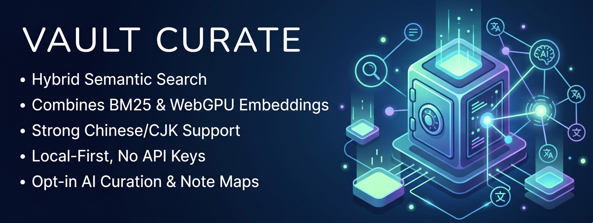
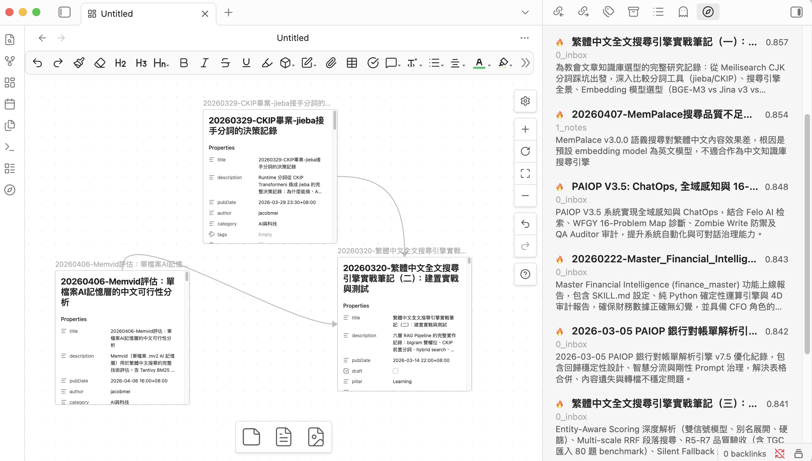
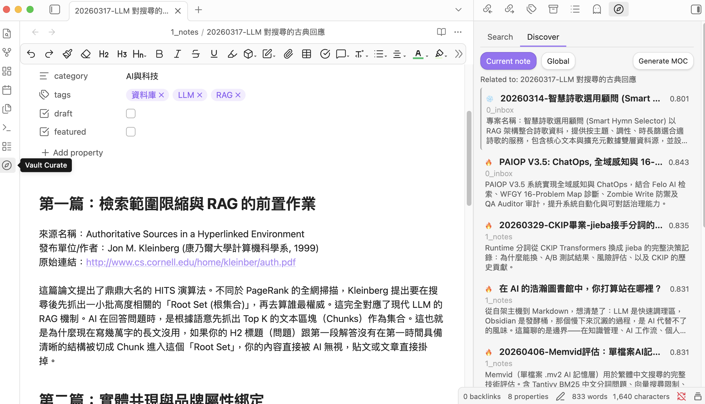

<div align="center">

# Vault Curate

[](https://github.com/notoriouslab/vault-curate/releases)
[](LICENSE)
[](https://obsidian.md/)
[]()
[](https://ollama.com/)
[](https://github.com/notoriouslab/vault-curate)

**High-quality Chinese-friendly semantic search for Obsidian, with optional AI curation.**

Traditional Chinese · Simplified Chinese · CJK · local-first · hybrid retrieval (BM25 + embeddings + fuzzy) · WebGPU on-device · no API keys

[繁體中文](https://github.com/notoriouslab/vault-curate/blob/main/README.zh-TW.md)



</div>

---

> ⓘ **Previously published as `vault-search`** (plugin id and repository renamed). A different plugin authored by a separate developer now occupies the `vault-search` id — see the [Upgrading from vault-search](#upgrading-from-vault-search) section below before installing if you used earlier versions.

## Why Vault Curate?

Obsidian's built-in search is literal: think "prayer" but your note says "devotional" and you'll miss it. Most semantic-search plugins use generic multilingual models, which tend to under-perform on Chinese content.

[Andrej Karpathy shared](https://venturebeat.com/data/karpathy-shares-llm-knowledge-base-architecture-that-bypasses-rag-with-an/) his vision of LLM-maintained knowledge bases — letting AI "compile" your notes into structured wikis. Compelling, but it asks you to hand over full editorial control. **Vault Curate takes a different stance: AI should help you *see*, not think for you.**

### Three differentiators

| Feature | How it works |
|---|---|
| **Chinese semantic quality beats generic multilingual models** | Ships with `bge-small-zh-v1.5` (Chinese-only training). In head-to-head testing on Chinese names, religious terms, and colloquial phrases, generic MiniLM-style multilingual models miss most of the matches; Vault Curate consistently recalls the right notes. |
| **Zero-config to run, WebGPU accelerated** | ~110 MB model downloads once. WebGPU indexing: 342 notes / 5,004 chunks in about **1m23s** (WASM fallback still works, around 27 minutes). |
| **AI curation is opt-in, never silent** | Description generation, MOC clustering, and frontmatter rewrites all require explicit opt-in. Nothing runs LLMs in the background and nothing rewrites your notes without you asking. |

---

## Quick Start

1. In Obsidian, go to **Settings → Community plugins** and search for **Vault Curate**
2. After enabling, the **Welcome to Vault Curate** modal opens. Under **Embedding provider**, pick **Built-in (on-device, WebGPU)** and click **Index my vault now**
3. After the ~110 MB model download and WebGPU indexing finish, click the sidebar compass icon and start searching

> ⚠️ Vault Curate is currently going through Obsidian's community review. If you can't find it in Community plugins yet, use the [Manual install](#manual-install) path below.

---

## Installation

**Requirements**
- [Obsidian](https://obsidian.md/) desktop (v1.0.0+)
- Advanced paths only: a local [Ollama](https://ollama.com/) instance or any OpenAI-compatible server

### From Community plugins (recommended)

1. Open **Settings → Community plugins** in Obsidian
2. Make sure **Restricted mode** is off, click **Community plugins → Browse**
3. Search **Vault Curate** → **Install** → **Enable**
4. The **Welcome to Vault Curate** modal opens automatically on first launch

### Manual install

1. Download `main.js`, `manifest.json`, `styles.css`, `worker.js`, `ort-wasm-simd-threaded.wasm` from [Releases](https://github.com/notoriouslab/vault-curate/releases)
2. Copy them into `.obsidian/plugins/vault-curate/` in your vault
3. Enable in **Settings → Community plugins**

> **Tip:** If your vault is Git-tracked, add `.obsidian/plugins/*/data.json` and `.obsidian/plugins/*/index.sqlite` to `.gitignore`.

---

## Upgrading from vault-search

If you used the earlier `vault-search` plugin, follow this path:

1. **Open your vault folder** and locate `.obsidian/plugins/vault-search/`
2. **Delete that folder directly** from the filesystem. ⚠️ Do *not* use Community plugins → Uninstall — a different plugin now occupies the `vault-search` id and may insert itself when you uninstall.
3. Install Vault Curate via the [Installation](#installation) steps above
4. **Enable**. The **Welcome to Vault Curate** modal will guide you through rebuilding the index.

Embeddings are not reused across versions — a from-scratch rebuild takes ~1–2 minutes on WebGPU for a few hundred notes. Frontmatter descriptions and tags already in your notes are preserved (they live in the `.md` files, not in the index).

If you had keybindings set on `vault-search:*` commands, redo them under `vault-curate:*` in **Settings → Hotkeys** (9 commands total — see [Commands](#commands)).

---

## Features

### Search (Hybrid Fusion)

Three signals combined via [Reciprocal Rank Fusion](https://plg.uwaterloo.ca/~gvcormac/cormacksigir09-rrf.pdf) (k=60):

| Path | Catches |
|---|---|
| **BM25** (pure TS, CJK trigram) | Exact phrases, keyword combinations |
| **Semantic embedding** | Different wording, same meaning |
| **Fuzzy title** (Jaro–Winkler) | Typos, spelling variants |

Two entry points:

- Cmd/Ctrl+P → `Vault Curate: Semantic search (modal)` for quick jump
- Sidebar → **Search** tab for persistent results



### Discover

Discover works on **notes**, not query strings — it surfaces semantically related **Cold notes** you haven't touched recently:

- **Current note**: when you open a file, related notes appear automatically, with Cold notes visually highlighted ("you haven't read this one")
- **Global**: Cold notes most related to your entire Hot pool — intentional blind-spot mining
- Results can be exported to a topic-grouped Map of Content via **Generate MOC** (falls back to a flat MOC if results are too few or too similar)



### Hot / Cold auto-tiering

Notes are auto-classified by **internal links + recency**:

- **Hot**: linked to / recently touched
- **Cold**: orphan / untouched for a while

The "recent" cutoff is tunable in **Settings → Advanced → Hot window (days)**. Cold notes don't get buried in Discover — they're exactly the content you should be re-seeing.

### Find similar notes

Right-click any `.md` → **VC: Find similar notes** → results show up in the sidebar; you can drag them straight to Canvas.

### Relation graph (Canvas)

Generate an editable **Obsidian Canvas** around any note: the note in the center (green), its top-K semantic neighbors laid out radially, every edge labeled with its similarity score.

- **Purple edges** = semantically close but **not yet linked** — connections the native graph view can't show you
- **Gray edges** (with direction arrows) = notes you've already wikilinked
- **Cyan nodes** = Cold notes (untouched beyond the Hot window)

Three entry points: the command palette, right-click **VC: Generate relation graph**, or the **Graph** button on the Discover sidebar (targets the pinned note if one is pinned). Each run writes a fresh timestamped `.canvas` into the folder set under Advanced → Relation graph folder (default `Vault Curate Canvases`) — your edited graphs are never overwritten. Want to go one hop deeper? Right-click any node inside the canvas → **VC: Generate relation graph**.

The output is a plain Canvas file — drag, edit, annotate, and delete freely.

### AI curation (off by default)

Turn it on under **Settings → AI Curation → Enable AI curation** to unlock three actions:

- Generate a description + tags into a single note's frontmatter
- Run description generation across the sidebar's search / discover results
- Generate a **topic-grouped MOC** via HDBSCAN clustering + LLM naming

The LLM provider is configured separately under **Settings → AI Curation** (local Ollama or any OpenAI-compatible endpoint).

---

## Commands

From Command Palette (Cmd/Ctrl+P), type `Vault Curate:` to see them all.

| Command | What it does | Requires |
|---|---|---|
| `Semantic search (modal)` | Modal-style semantic search with quick jump | always available |
| `Open search panel` | Open the sidebar panel | always available |
| `Find similar notes` | Find semantically related notes to the active `.md` | always available |
| `Rebuild index` | Wipe the existing index and re-index everything | always available |
| `Update index` | Incremental update (re-index files with newer mtime) | always available |
| `Discover related Cold notes` | Global discover: Cold notes most related to your Hot pool | always available |
| `Generate relation graph (Canvas)` | Editable Canvas of the active note's semantic neighborhood | always available |
| `Generate description for active note` | LLM-write description + tags to the active file's frontmatter | AI curation on |
| `Generate descriptions for current results` | Batch description for the current sidebar results | AI curation on |
| `Generate MOC (topic-grouped)` | HDBSCAN cluster + LLM-name each group | AI curation on |

Right-click menus expose three of these directly on a `.md`:

- **VC: Find similar notes**
- **VC: Generate relation graph**
- **VC: Generate description** (AI curation on)

---

## Settings

The settings panel is split into three sections:

### Quick setup

| Setting | Default | Note |
|---|---|---|
| Embedding provider | Built-in (on-device, WebGPU) | One of three: Built-in / Ollama / OpenAI-compatible |
| Excluded folders | (empty) | Folder globs that won't be indexed |

Changing the embedding provider or model triggers a confirmation modal — the index is wiped and rebuilt.

### AI Curation

| Setting | Default | Note |
|---|---|---|
| Enable AI curation | off | When off, description / MOC commands stay hidden |
| LLM provider | Ollama | The endpoint used for description + MOC naming |
| LLM model | qwen3:1.7b | Recommended default; any Ollama model works |

### Advanced

Collapsible `<details>` block: top results / min score / relation graph folder / Hot window (days) / default search scope (Hot / Cold / All) / chunk size + overlap / synonym list / auto-index toggle / rebuild + update buttons / index stats.

---

## Privacy

Three embedding modes, picked from **Quick setup → Embedding provider**:

| Mode | Where embeddings run | Where note text goes |
|---|---|---|
| **Built-in** | On-device WebGPU / WASM | Stays on your device |
| **Ollama (local daemon)** | Local Ollama daemon on 127.0.0.1 | Stays on your device |
| **OpenAI-compatible API** | Any endpoint you point it at — could be local (LM Studio, llama.cpp, …) **or** remote (OpenAI etc.) | Depends on the endpoint you choose; may leave your device |

The same applies to AI curation (description / MOC naming), which uses an independently-configured LLM endpoint.

**No telemetry. No usage tracking. Nothing is sent to any server unless you configure a remote endpoint.**

### Audit disclosures

The Obsidian Developer Dashboard's automated audit may flag the following items on this plugin. They are intentional and disclosed here for transparency:

- **Vault enumeration** (`vault.getMarkdownFiles()`): The indexer needs to walk the full list of markdown files in your vault to build the semantic embedding index. The `excludePatterns` setting (Settings → Advanced) lets you scope this — e.g. excluding `_templates/`, `.trash/`, or any folder you don't want indexed. No file is read until it's in the included set.
- **Dynamic code execution** (`new Function` in bundled `@huggingface/transformers`): The Hugging Face Transformers library uses `new Function` internally to create type-safe method dispatchers during model loading. Vault Curate's own source code contains **zero** `eval()` or `new Function()`. We bundle the upstream library as-is to avoid divergence; the dynamic dispatch happens only inside the embedding model's tokenizer/inference setup, not on any vault content.
- **Direct filesystem access**: The bundled `sql.js` ships an Emscripten output with a Node.js fallback path that imports `node:fs` / `node:crypto`. These branches are dead code in Obsidian's renderer process (gated by `process.type !== "renderer"`). As of v1.0.3, the esbuild config strips those `require()` strings from the released bundle so the audit no longer sees them.

### 🔒 About API key storage

Vault Curate, like every Obsidian plugin, stores its settings (including any OpenAI API key) as plain text in `<vault>/.obsidian/plugins/vault-curate/data.json`. This is Obsidian's plugin storage mechanism, not a vault-curate-specific design choice.

If your vault syncs to a cloud service (iCloud / Dropbox / Google Drive) or pushes to a public Git repository, you should:

1. Add `.obsidian/plugins/vault-curate/data.json` to your sync exclusion list or `.gitignore`
2. Or use the **Built-in** model / **Ollama** path — neither requires an API key

---

## Tech Stack

- **TypeScript** + **esbuild** (two-stage bundle for worker + main)
- **sql.js** (SQLite via WASM) for the storage layer — replaces v0.x's `data.json` / `index.json`
- **Pure-TS BM25+** (`src/storage/bm25.ts`) for CJK-aware full-text search (no native FTS5 dependency)
- **`@huggingface/transformers`** + **`bge-small-zh-v1.5` q8** (~110 MB, WebGPU/WASM) for on-device embeddings
- **`hdbscan-ts`** for topic clustering (MOC)
- **Reciprocal Rank Fusion** (k=60) combining BM25 + semantic + fuzzy
- **Optional**: [Ollama](https://ollama.com/) / any OpenAI-compatible endpoint for higher-end embedding or LLM models

---

## Development

```bash
git clone https://github.com/notoriouslab/vault-curate.git
cd vault-curate
npm install
npm run dev    # watch mode
npm run build  # production build
npm test       # vitest unit tests (59 tests)
```

---

## License

[MIT](./LICENSE)
