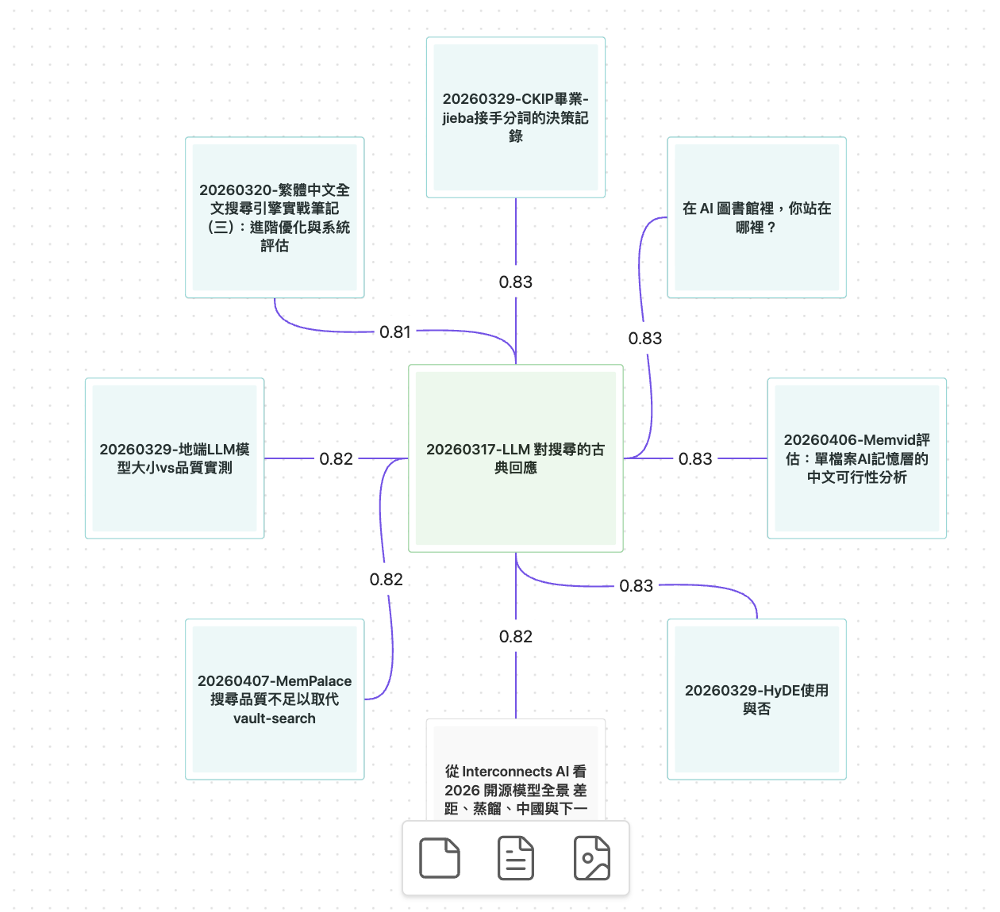

<div align="center">

# Vault Curate

[](https://github.com/notoriouslab/vault-curate/releases)
[](LICENSE)
[](https://obsidian.md/)
[]()
[](https://ollama.com/)
[](https://github.com/notoriouslab/vault-curate)

**為 Obsidian 打造的高品質中文語意搜尋與 AI 整理工具。**

繁體中文 · 簡體中文 · 本地推論 · 三路融合搜尋（BM25 + 向量 + 模糊）· WebGPU 加速 · 不上傳資料

[English](./README.md)


</div>

---

> ⓘ **本 plugin 前身為 `vault-search`**（plugin id 與 repository 已改名）。目前 `vault-search` id 由另一位開發者的同名 plugin 佔用 — 若你曾使用舊版，請先閱讀下方 [從 vault-search 升級](#從-vault-search-升級) 章節再安裝。

## 為什麼選 Vault Curate？

Obsidian 內建搜尋只認字面比對：你想到「禱告」但筆記寫的是「靈修」就找不到。市面上的語意搜尋外掛多數使用通用 multilingual 模型，中文準度普遍偏弱。

[Andrej Karpathy 分享了](https://venturebeat.com/data/karpathy-shares-llm-knowledge-base-architecture-that-bypasses-rag-with-an/)他用 LLM 維護知識庫的願景 — 讓 AI「編譯」筆記成結構化 wiki。願景很吸引人，但前提是把編輯權完全交給 AI。**Vault Curate 走另一條路：AI 應該幫你「看見」，不是替你思考。**

### 三大差異化特色

| 特色 | 如何做到 |
|---|---|
| **中文語意品質贏多語通用模型** | 內建 `bge-small-zh-v1.5`（純中文訓練）。實測中文人名、宗教詞、口語短語等查詢，通用 MiniLM 等多語模型命中率偏低，Vault Curate 能穩定召回對應筆記。 |
| **零設定就能跑，WebGPU 加速** | 首次下載 ~110 MB 模型，WebGPU 跑索引：342 篇 / 5004 chunks 約 **1m23s**（WASM fallback 仍可用，約 27 分鐘）。 |
| **AI 整理 opt-in，預設不踩線** | description 生成與 MOC 主題分群必須手動開啟。不會在背景自動跑 LLM、不會自動改你的筆記。 |

---

## 快速開始

1. 在 Obsidian「**設定 → 第三方外掛程式 → 社群外掛程式**」搜尋並安裝 **Vault Curate**
2. 啟用後跳出「**歡迎使用 Vault Curate**」視窗，**Embedding 提供者** 選「**內建（裝置端、WebGPU）**」→ 點「**現在開始建立索引**」
3. 約 110 MB 模型一次性下載 + WebGPU 索引完成後，點側邊欄羅盤 icon 開始搜尋

> ⚠️ Vault Curate 目前提交 Obsidian 社群審核中。上架前推薦走 [BRAT 安裝](#brat-安裝)（含自動更新），或下方 [手動安裝](#手動安裝)。

---

## 安裝

**需求**
- [Obsidian](https://obsidian.md/) 桌面版（v1.0.0+）
- 進階用法（搭配 Ollama / OpenAI-compatible）額外需要：本機 [Ollama](https://ollama.com/) 或任意 OpenAI-compatible 伺服器

### 從社群外掛程式安裝（推薦）

1. 在 Obsidian 開啟「**設定 → 第三方外掛程式**」
2. 確認「**限制模式**」已關閉，點「**社群外掛程式**」→「**瀏覽**」
3. 搜尋 **Vault Curate** → 點「**安裝**」→「**啟用**」
4. 首次啟用會自動跳出「**歡迎使用 Vault Curate**」視窗

### BRAT 安裝

社群審核期間，用 [BRAT](https://github.com/TfTHacker/obsidian42-brat)（Beta Reviewers Auto-update Tool）可一鍵安裝且**每次 release 自動更新**：

1. 在社群外掛程式安裝並啟用 **BRAT**
2. Cmd/Ctrl+P → `BRAT: Add a beta plugin for testing` → 輸入 `notoriouslab/vault-curate`
3. 到「**設定 → 社群外掛程式**」啟用 **Vault Curate**，歡迎視窗會接手引導

之後每次新版發布 BRAT 會自動帶上（或手動 `BRAT: Check for updates to all beta plugins`）。

### 手動安裝

1. 從 [Releases](https://github.com/notoriouslab/vault-curate/releases) 下載 `main.js`、`manifest.json`、`styles.css`（兩個 `.wasm` runtime 首次啟動會自動下載）
2. 複製到 vault 的 `.obsidian/plugins/vault-curate/`
3. 在「**設定 → 社群外掛程式**」啟用

> **提示**：vault 若有 Git 追蹤，建議在 `.gitignore` 加上 `.obsidian/plugins/*/data.json` 與 `.obsidian/plugins/*/index.sqlite`。

---

## 從 vault-search 升級

如果你曾用過舊版 `vault-search`，請依此步驟：

1. **打開 vault 資料夾**，找到 `.obsidian/plugins/vault-search/`
2. **直接從檔案系統刪除整個資料夾**。⚠️ **不要**在「社群外掛程式 → 卸載」執行卸載 — 目前 `vault-search` id 由另一個 plugin 佔用，按卸載可能會被它插入。
3. 依上方 [安裝](#安裝) 步驟安裝 Vault Curate
4. **啟用**。「**歡迎使用 Vault Curate**」視窗會引導你建立新索引

舊版 embedding 不會被沿用 — WebGPU 路徑下幾百篇筆記重建約 1–2 分鐘。筆記裡既有的 frontmatter（description / tags）會完整保留（這些存在 `.md` 檔案、不在索引裡）。

如果你之前對 `vault-search:*` 指令設過快捷鍵，請到「**設定 → 快捷鍵**」改為 `vault-curate:*`（共 9 個指令，見 [指令一覽](#指令一覽)）。

---

## 主要功能

### 搜尋（Hybrid Fusion）

三路訊號用 [Reciprocal Rank Fusion](https://plg.uwaterloo.ca/~gvcormac/cormacksigir09-rrf.pdf)（k=60）融合：

| 路徑 | 抓什麼 |
|---|---|
| **BM25**（純 TS，CJK trigram） | 確切字詞、關鍵字組合 |
| **語意 embedding** | 意思相近、不同說法 |
| **模糊標題比對**（Jaro–Winkler） | 錯字、拼寫變體 |

兩個入口：

- Cmd/Ctrl+P → `Vault Curate: 語意搜尋（彈窗）` 快速跳轉
- 側邊欄 → **搜尋** tab 持續顯示結果


### 發掘

對應**筆記**、不對應查詢字串 — 把語意相關但你近期沒碰的 **Cold 筆記**浮上來：

- **當前筆記**：開啟筆記時自動顯示相關筆記，Cold 視覺突顯（「你還沒碰過這篇」）
- **全域**：與整個 Hot 池子最相關的 Cold 筆記，刻意挖掘盲區
- 結果可一鍵「**生成 MOC**」輸出為主題分群 Map of Content（結果太少或主題過於相近時會自動生成條列式 MOC）


### Hot / Cold 自動分層

依「**內部連結 + 近期建立**」分類：

- **Hot**：被連結到 / 近期碰過
- **Cold**：孤立 / 久未碰過

「近期」的天數可在「**設定 → 進階 → Hot 天數**」調整。Cold 筆記不會在發掘裡被埋掉 — 它們才是該被重新看見的內容。

### 尋找相似筆記

任意 `.md` 右鍵 → **VC: 尋找相似筆記** → 結果顯示在側邊欄；可拖曳到畫布（Canvas）。

1.2.0 起相似度抗模板：embedding 輸入會剝除 markdown 結構符號（表格框線、`█▃▅` 條等），frontmatter 的 `description`（若有）會加權進筆記排名向量——人物卡找到的是**這個人**的對話，而不是九張同模板的兄弟卡。

1.2.2 起 embedding 輸入另做繁→簡字級轉換（內建 4,105 字靜態表；筆記原文、關鍵字搜尋、摘要、description 產生全部保持繁體）——bge-small-zh 以簡體語料訓練為主，轉換讓向量落在模型訓練最足的 token 空間，實測不相關的「萬用閒聊」筆記排名再甩遠 3-4 倍。升級後首次啟動會自動做一次性重索引，有進度通知、不需手動 Rebuild。

### 關聯圖（Canvas）

以任一筆記為中心，生成**可編輯的 Obsidian Canvas**：中心筆記（綠框）+ top-K 語意鄰居放射狀排列，每條邊都標注相似度分數。

- **紫邊** = 語意相近但**尚未建立連結**——原生 Graph view 看不到的隱形關聯
- **灰邊**（帶方向箭頭）= 已有 wikilink 的筆記
- **青框節點** = Cold 筆記（超過 Hot 期間未動的舊筆記）

三個入口：命令面板、右鍵 **VC: 生成關聯圖**、Discover 側欄的**關聯圖**按鈕（若有釘選筆記則以釘選者為中心）。每次生成都是帶時間戳的新 `.canvas` 檔（位置在「進階 → 關聯圖資料夾」，預設 `Vault Curate Canvases`），您編輯過的圖永遠不會被覆寫。想往外多走一層？對 Canvas 內任一節點右鍵 → **VC: 生成關聯圖**。

生成的就是普通 Canvas 檔——拖曳、編輯、註記、刪除隨意。



### AI 整理（預設關閉）

在「**設定 → AI 整理 → 啟用 AI 整理**」開啟後解鎖三件事：

- 為單篇筆記生成 description + tags 寫入 frontmatter
- 對側邊欄搜尋／發掘結果**批次**跑 description
- 用 HDBSCAN 分群 + LLM 命名生成**主題分群 MOC**

LLM provider 在「**設定 → AI 整理**」獨立指定（可用本機 Ollama 或 OpenAI-compatible）。

---

## 指令一覽

從 Command Palette（Cmd/Ctrl+P）輸入 `Vault Curate:` 可看到全部指令。

| 指令 | 說明 | 啟用條件 |
|---|---|---|
| `語意搜尋（彈窗）` | 彈窗式語意搜尋 + 跳轉 | 永遠可用 |
| `開啟搜尋面板` | 開啟側邊欄面板 | 永遠可用 |
| `尋找相似筆記` | 對當前 `.md` 找語意相似筆記 | 永遠可用 |
| `重建索引` | 砍掉現有索引、全部重新建立 | 永遠可用 |
| `更新索引` | 增量更新（檢查 mtime 變動的筆記） | 永遠可用 |
| `發掘相關的 Cold 筆記` | 全域發掘：列出整個 Hot 池子最相關的 Cold 筆記 | 永遠可用 |
| `生成關聯圖（Canvas）` | 對當前筆記生成可編輯的語意鄰域 Canvas | 永遠可用 |
| `為當前筆記生成 description` | 對當前筆記跑 LLM、寫 frontmatter | 需啟用 AI 整理 |
| `為目前結果生成 description` | 對側邊欄結果批次跑 description | 需啟用 AI 整理 |
| `生成 MOC（主題分群）` | HDBSCAN 分群 + LLM 命名，輸出主題分群 MOC | 需啟用 AI 整理 |

也可以從筆記右鍵選單呼叫：

- **VC: 尋找相似筆記** — 對該 `.md` 找相似
- **VC: 生成關聯圖** — 對該 `.md` 生成語意鄰域 Canvas
- **VC: 生成 description** — 對該 `.md` 跑 description（需啟用 AI 整理）

---

## 設定

設定分三層：

### 快速設定

| 項目 | 預設 | 說明 |
|---|---|---|
| Embedding 提供者 | 內建（裝置端、WebGPU） | 三選一：內建 / Ollama / OpenAI-compatible |
| 排除資料夾 | （空） | 不索引的資料夾 glob |

切換 embedding 提供者或模型會清空索引並重新建立（系統會跳 modal 確認）。

### AI 整理

| 項目 | 預設 | 說明 |
|---|---|---|
| 啟用 AI 整理 | 關閉 | 開啟後才會出現 description 生成 / MOC 等指令 |
| LLM 提供者 | Ollama | description 與 MOC 命名使用的 LLM endpoint |
| LLM 模型 | qwen3:1.7b | 推薦模型；可改其他 Ollama 模型 |

### 進階

收在 `<details>` 摺疊區，包含：顯示筆數 / 最低分數 / 關聯圖資料夾 / Hot 期間天數 / 搜尋範圍預設值（Hot / Cold / All）/ chunk size + overlap / 同義詞表 / 自動索引開關 / 重建與更新索引按鈕 / 索引統計。

---

## 隱私

三種 embedding 模式（在「**快速設定 → Embedding 提供者**」切換）：

| 模式 | Embedding 在哪算 | 筆記內容去哪 |
|---|---|---|
| **內建** | 裝置端 WebGPU / WASM | 留在裝置上 |
| **Ollama（本機 daemon）** | 本機 Ollama daemon（127.0.0.1） | 留在裝置上 |
| **OpenAI-compatible API** | 你指定的任意 endpoint — 可是本機（LM Studio / llama.cpp 等）**也可以**是遠端 API（OpenAI 等） | 視你選的 endpoint 而定，可能離開裝置 |

AI 整理（description / MOC 命名）所用的 LLM endpoint 另外設定，相同邏輯適用。

**不蒐集任何使用紀錄，不主動向任何伺服器回傳資料。**

### 審查說明

Obsidian Developer Dashboard 自動審查可能對本 plugin 提出以下 finding，以下為刻意設計並在此公開說明：

- **Vault 列舉**（`vault.getMarkdownFiles()`）：indexer 需遍歷整個 vault 的 markdown 檔案列表才能建立 semantic embedding 索引。可在「設定 → 進階」的 `excludePatterns` 範圍掃描——例如排除 `_templates/`、`.trash/` 或任何不想索引的資料夾。未在包含集合內的檔案不會被讀取。
- **動態程式碼執行**（bundled `@huggingface/transformers` 的 `new Function`）：Hugging Face Transformers 內部於 model loading 過程用 `new Function` 建立 type-safe method dispatchers。Vault Curate 自身原始碼**零**個 `eval()` / `new Function()`。我們直接 bundle 上游 library 避免分叉；dynamic dispatch 只發生在 embedding model 的 tokenizer / inference 初始化，不會在 vault 內容上執行。
- **直接檔案系統存取**：bundled `sql.js` 的 Emscripten 輸出含 Node.js fallback path 會 import `node:fs` / `node:crypto`。這些分支在 Obsidian renderer process 下是 dead code（由 `process.type !== "renderer"` 阻擋）。v1.0.3 起 esbuild 設定會把這些 `require()` 字串從 release bundle 完全移除，audit 不會再看見它們。

### 🔒 關於 API key 儲存

Vault Curate 跟所有 Obsidian plugin 一樣，將設定（含 OpenAI API key）以明文存放於 `<vault>/.obsidian/plugins/vault-curate/data.json`。這是 Obsidian 的 plugin 儲存機制，並非 Vault Curate 獨有做法。

若你的 vault 會同步到雲端服務（iCloud / Dropbox / Google Drive 等）或 push 到 public Git repository，請：

1. 將 `.obsidian/plugins/vault-curate/data.json` 加入同步排除清單或 `.gitignore`
2. 或改用**內建**模型 / **Ollama** 路徑——這兩種完全不需 API key

---

## 技術棧

- **TypeScript** + **esbuild**（worker + main 兩階段 bundle）
- **sql.js**（SQLite via WASM）儲存層 — 取代 v0.x 的 `data.json` / `index.json`
- **純 TS BM25+**（`src/storage/bm25.ts`）做 CJK 友善全文搜尋（不依賴原生 FTS5）
- **`@huggingface/transformers`** + **`bge-small-zh-v1.5` q8**（~110 MB，WebGPU/WASM）裝置端 embedding
- **`hdbscan-ts`** 做主題分群（MOC）
- **Reciprocal Rank Fusion**（k=60）融合 BM25 + 語意 + 模糊三路
- **可選**：[Ollama](https://ollama.com/) / 任意 OpenAI-compatible endpoint 接更高階 embedding 或 LLM

---

## 開發

```bash
git clone https://github.com/notoriouslab/vault-curate.git
cd vault-curate
npm install
npm run dev    # 監看模式
npm run build  # 產生 production build
npm test       # vitest 單元測試（59 tests）
```

---

## License

[MIT](./LICENSE)
